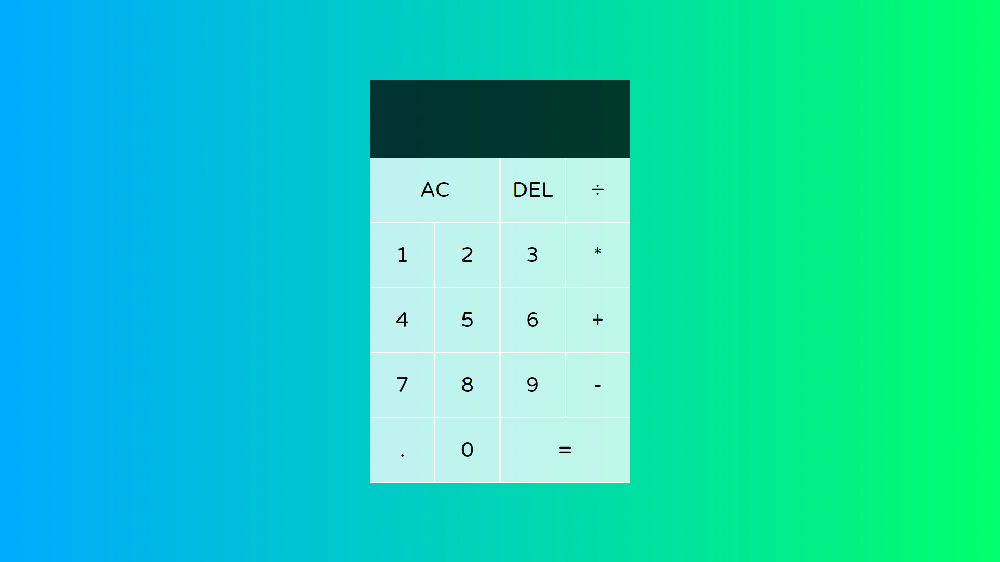
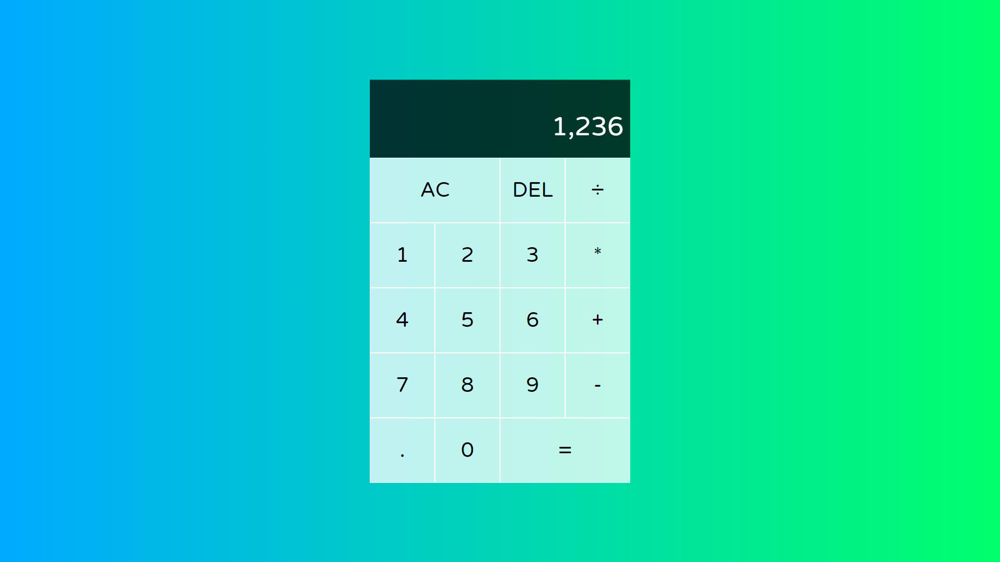
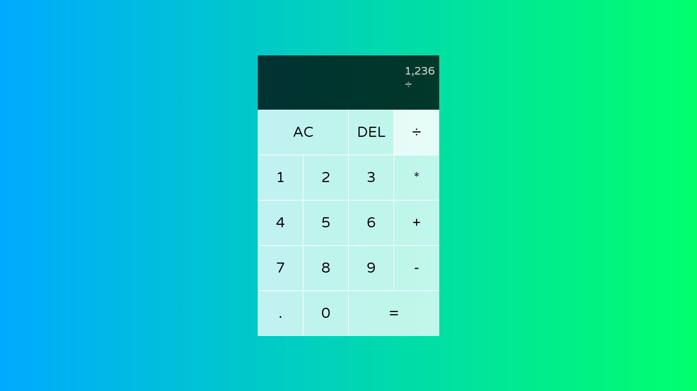
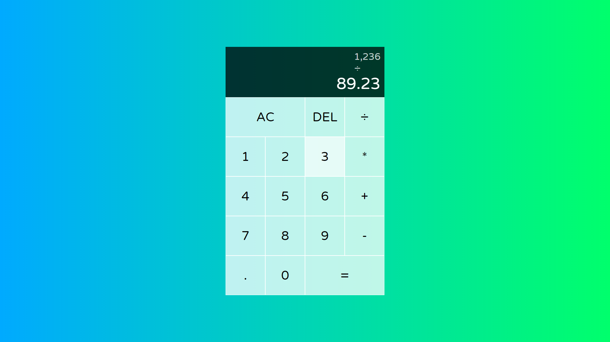
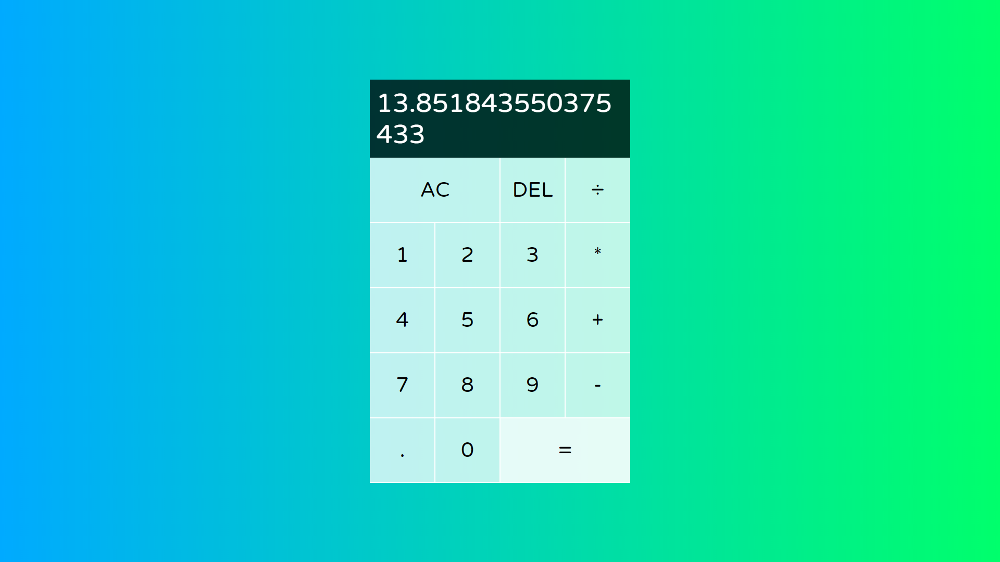
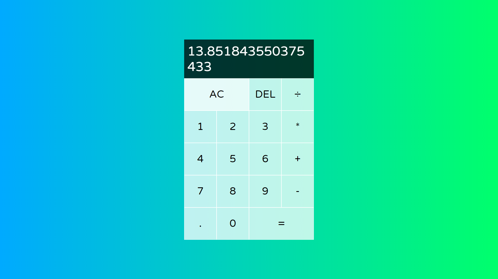
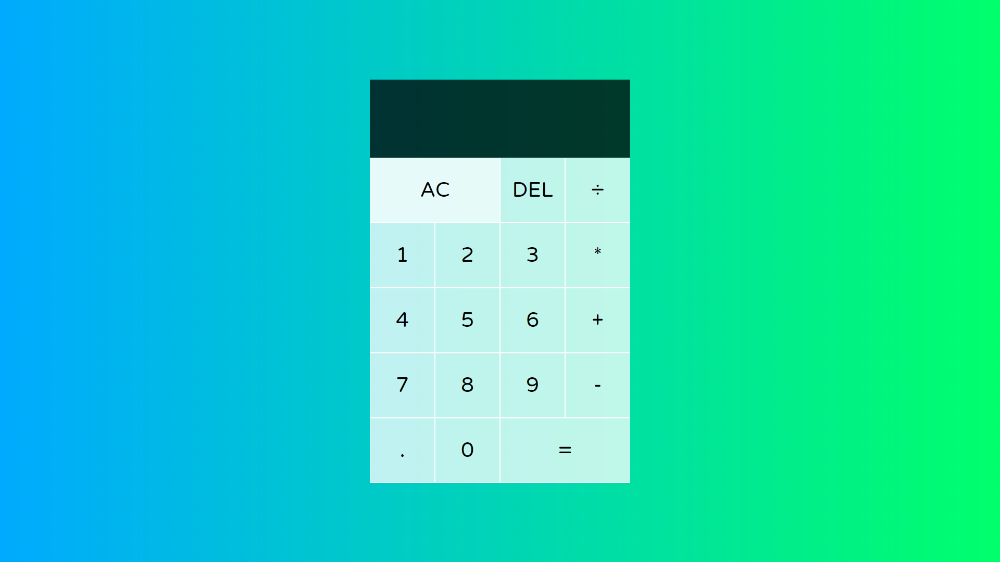

# simple-calculator-tutorial-WDS

This Calculator is from a [tutorial](https://www.youtube.com/watch?v=j59qQ7YWLxw&list=PLZlA0Gpn_vH8DWL14Wud_m8NeNNbYKOkj&index=5) by [Web Dev Simplified](https://www.youtube.com/channel/UCFbNIlppjAuEX4znoulh0Cw). None of the code is mine. It is a great tutorial for all skill levels of javascript developers and a great introduction to ES6.

Here the calculator is opened:

Here is the first operand, I chose a large number to illustrate that the calculator displays the content with dividing commas:

Here the number will be divided. It is still displayed; along with the operator.

The number is divided by a decimal:

The results - notice that the number wraps:

To clear, one can push the all clear button:

Everything is cleared:

My rendering of this tutorial is [published on GitHub](https://martucazpo.github.io/simple-calculator-tutorial-WDS/), try it out!